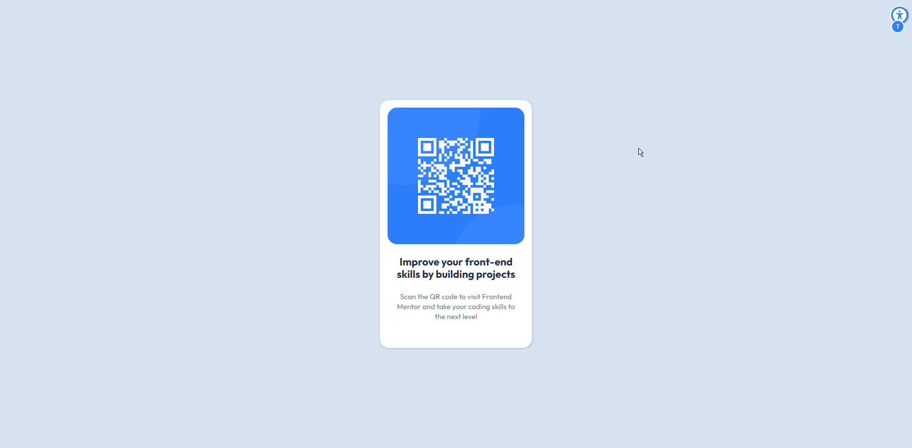

# Frontend Mentor - Solução para componente de código QR

Esta é uma solução para o [desafio de componente de código QR no Frontend Mentor](https://www.frontendmentor.io/challenges/qr-code-component-iux_sIO_H). Os desafios do Frontend Mentor ajudam você a aprimorar suas habilidades de programação por meio da criação de projetos realistas.

## Sumário

- [Visão geral](#visão-geral)
- [Captura de tela](#captura-de-tela)
- [Links](#links)

- [Meu processo](#meu-processo)
- [Criado com](#desenvolvido-com)
- [O que aprendi](#o-que-aprendi)
- [Desenvolvimento contínuo](#desenvolvimento-contínuo)
- [Recursos úteis](#recursos-úteis)
- [Colaboração com IA](#colaboração-com-IA)
- [Autor](#autor)
- [Agradecimentos](#agradecimentos)

## Visão geral

### Captura de tela

### Links

- [URL da solução](https://www.frontendmentor.io/solutions/qr-code-component-iVV9UBRkil)
- [URL do site em produção](https://raphaelsiqueiira.github.io/qrcode-component-main/)

## Meu processo

### Desenvolvido com

- Linguagens: HTML5, CSS3, JavaScript (ES6+)
- Metodologia: BEM (Block Element Modifier)
- Tooling: Webpack, Babel, Lightning CSS, ESLint
- Layout: Flexbox

### O que aprendi

- Acessibilidade (A11y): Implementei um modal de preferências que permite ao usuário ajustar o tamanho do texto e alternar temas de cor, respeitando as preferências do sistema.

 - Metodologia [BEM](https://getbem.com/introduction/): Utilizei a convenção Block Element Modifier para manter o CSS organizado e evitar conflitos de escopo, facilitando a manutenção do componente. Foi meu primeiro contato com essa metodologia, mas gostei do desafio de tentar algo novo

 - Semântica HTML: Substituí o uso excessivo de div por elementos mais semânticos e que fazem sentido para o navegador e leitores de tela.

 Para um projeto como esse não seria necessário utilizar tantas ferramentas como webpack e babel, mas às usei para reforçar meus conhecimentos

### Desenvolvimento contínuo

Quero continuar evoluindo minha lógica no JavaScript. Sinto que o código funciona, mas quero que ele seja cada vez mais limpo e eficiente. Outra meta é levar esse modal de acessibilidade para o próximo nível, deixando ele ainda mais robusto e fácil de reutilizar em outros projetos, sempre focando em SEO e na experiência de todo tipo de usuário.

### Recursos úteis

- [BEM — Block Element Modifier](https://getbem.com/introduction/) - Ainda não conheci essa metodologia e não sei muito sobre sua aplicação no dia a dia profissional. Mas gostei da ideia e quis me desafiar a tentar algo novo, e acabei gostando bastante. Essse conteúdo me ajudou a entender sobre.

- [Qual é a principal diferença entre as tags <section> e <article>?](https://www.reddit.com/r/webdev/comments/15q5pl9/whats_main_difference_between_section_and_article/?tl=pt-br) - Este é um pot no reddit que me ajudou a entender melhor as diferenças entre article e section. Durante o desenvovlimento do projeto teve algums momentos que utilizei divs ou sectons, que depois consegi notar que poderiam ser substituido por elementos mais semanticos  

- [Origamid](https://www.origamid.com/) A maioria dos meus conhecimentos vieram do curso da Origamid. Apesar de eu ainda não ter nem metade da expertise do excelente estrutor, me ajudou muito no meu conehcimento e a saber procurar recursos quando eu não souver como fazer algo

### Colaboração com IA

Apesar de eu possuir um receio do uso IA nesse momento inical prejudicar a minha aprendizagem, utilizei o Gemini para me auxiliar em alguns pontos como:

- Nomeação de classes, propriedades, metodos

- Dúvidas pontuais que surgiram durante o desenvolvimento "Ex: se devo adicionar o width e height na tag img ou na tag picture que engloba as imagens do qrcode"

- Dúvidas sobre as configurações das dependencias das ferramentas de build

- Tente utilizar a IA mais como um mentor / instrutor. Sem realizar perguntas diretas de como fazer, ou pedindo para criar algo. Mas ssim validando minha lógica, me guiando na solução que eu apontava que seria a desejada

## Autor

- Frontend Mentor - [@raphaelsiqueiira](https://www.frontendmentor.io/profile/raphaelsiqueiira)
- GitHub - [raphaelsiqueiira](https://github.com/raphaelsiqueiira)

## Agradecimentos

Agradeço a todos as pessoas que criaram os artigos mencionados e ao André Rafael pelo excelente curso da Orgamid 